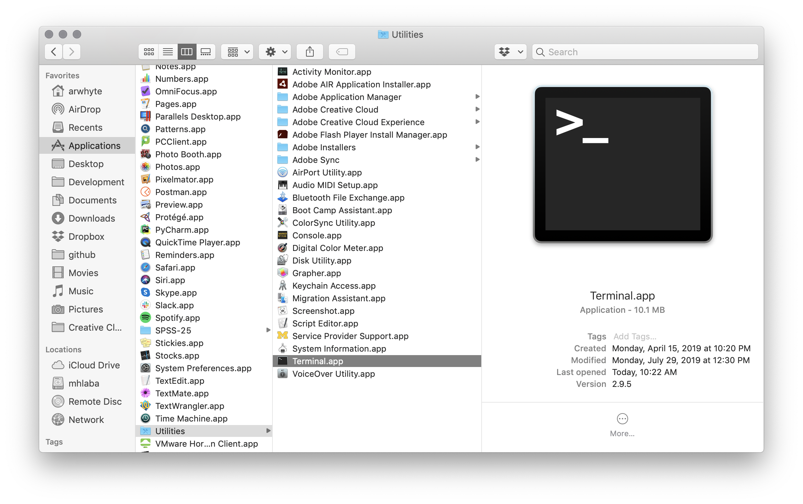
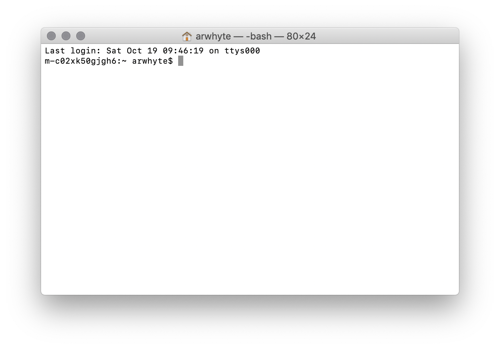
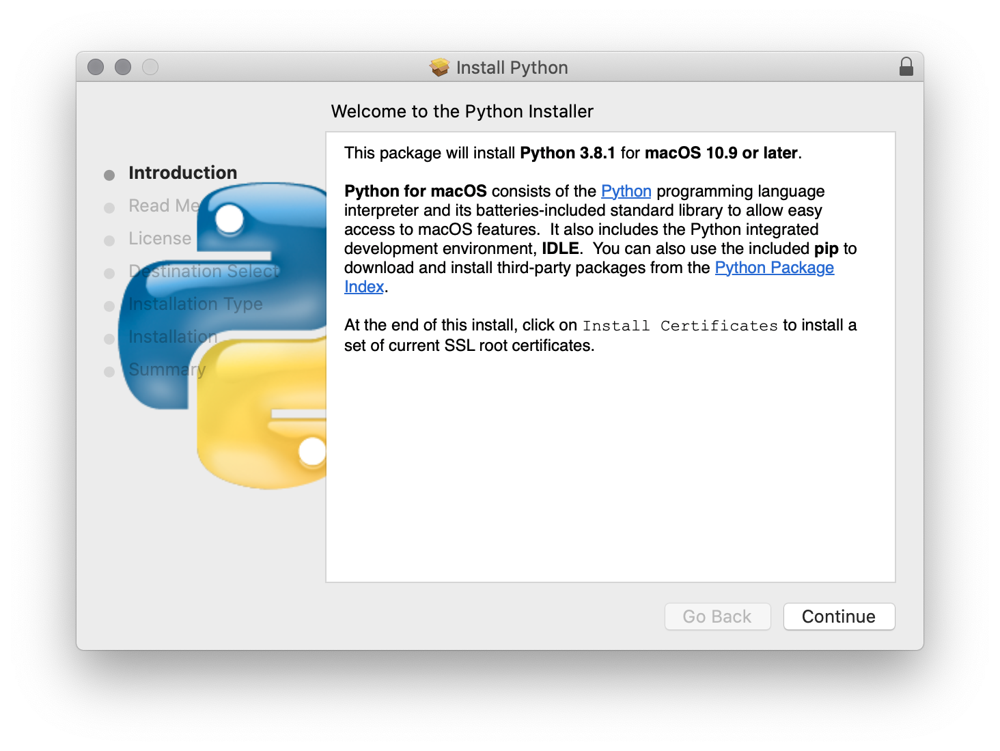
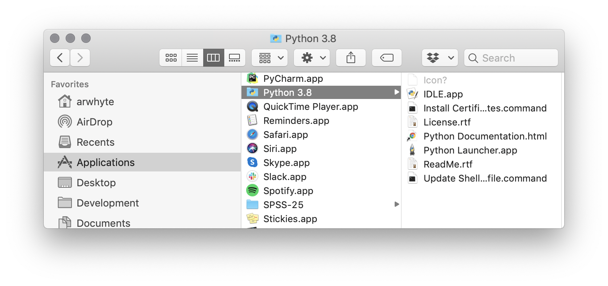

# macOS: Installing Python 3
There are several ways to install and manage Python on the Mac. The install steps that I describe below are 
arguably the simplest approach to getting Python 3 up and running on your machine.

:exclamation: Both Python 3.8.1 and the maintenance release Python 3.7.6 were released on 18 
December 2019. You can install either version but I recommend opting for Python 3.8.1 since it 
constitutes the default download release version.

## 1.0 Locate and open Terminal.app
Mac includes a Unix terminal called `Terminal.app` that you can use to issue Bash shell commands. Use `Finder` to locate 
`Terminal.app` in the directory `Applications/Utilities/`. You can traverse the directory structure by clicking on 
each folder or use the keyboard shortcut: (`Command + Shift + U`). 

:bulb: I recommend dragging the `Terminal.app` icon to your dock in order to simplify accessing `Terminal.app` in future 
(you will be using it frequently).



Double-click Terminal.app's icon to open it. The terminal opens with a white background. If you want to change the 
background color see the following _StackExchange_
[thread](https://apple.stackexchange.com/questions/92756/how-do-you-change-mac-terminal-theme-so-that-it-doesnt-go-back-to-basic-every).



:exclamation: To close a terminal session type 'exit' at the prompt and then press __Return__ key.

## 2.0 Check if Python is installed
At the prompt, type the following line `python --version` and then press the __Return__ key: 

```commandline
$ python --version
Python 2.7.10
```

Mac comes with Python 2.7.x pre-installed. You need Python 3. Check and see if you have Python 3.x installed:

```commandline
$ python3 --version
Python 3.7.6
```

If Python 3.7.x or 3.8.x is installed you are in good shape and need do nothing more. The more likely 
scenario is that _no version information is returned_. No problem, installing Python 3 is not difficult.

## 3.0 Install Python 3
Go to the Python Software Foundation [website](https://www.python.org). Hover over "Downloads" on the blue menu bar. Your 
macOS operating system version should have been detected on the page load (misidentified as Mac OS X--the old name) and
the link to the Python 3.8.x release package displayed as a grey button. Click the grey button to download the install 
package.


Once downloaded to your `Downloads` directory, double-click the Python 3.8.x `*.pkg` file. Click the "Continue" button 
and proceed with the installation. I recommend installing Python 3 in the default `Applications` directory.



The Python installer will install the Python framework in the directory `/Library/Frameworks/`. You can confirm this
by typing `which python3` in the terminal and then press the __Return__ key:

```commandline
$ which python3
/Library/Frameworks/Python.framework/Versions/3.8/bin/python3
```

## 4.0 IDLE / Visual Studio Code
The Python installer also installs Python's Integrated Development and Learning Environment (IDLE). The `IDLE` 
app provides a multi-window text editor, interactive shell window, search/replace, and debugger. It is one of several 
text editors that you can use to write and test Python code. To learn more about IDLE 
see [https://docs.python.org/3/library/idle.html](https://docs.python.org/3/library/idle.html).



I recommend that instead of using IDLE you download, install, and use Microsoft's popular (and free) 
[Visual Studio Code](https://code.visualstudio.com/). See the companion tutorial 
[Windows 10: Installing Visual Studio Code](win-install_vscode_with_py_extension.md) for 
installation instructions. 

There are of course other solutions that you can choose. A few of the more popular apps include: 

* [Atom](https://atom.io/), 
* [Sublime Text](http://www.sublimetext.com/) or
* [PyCharm](https://www.jetbrains.com/pycharm/) interactive development environment (IDE) \[note: you 
_must_ apply to JetBrain's for a free [student](https://www.jetbrains.com/student/) license\]

That said, VS Code is all the rage these days and I suggest that you try it out.

## License
<a rel="license" href="http://creativecommons.org/licenses/by/4.0/"></a><br />This work is licensed under a <a rel="license" href="http://creativecommons.org/licenses/by/4.0/">Creative Commons Attribution 4.0 International License</a>.
