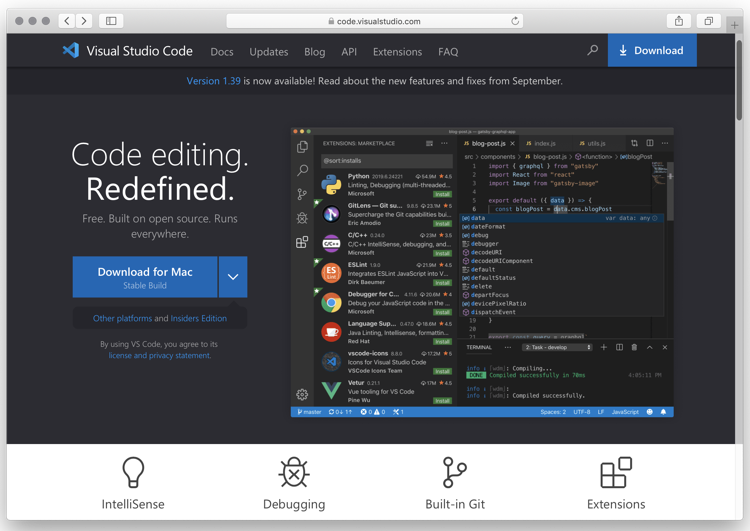
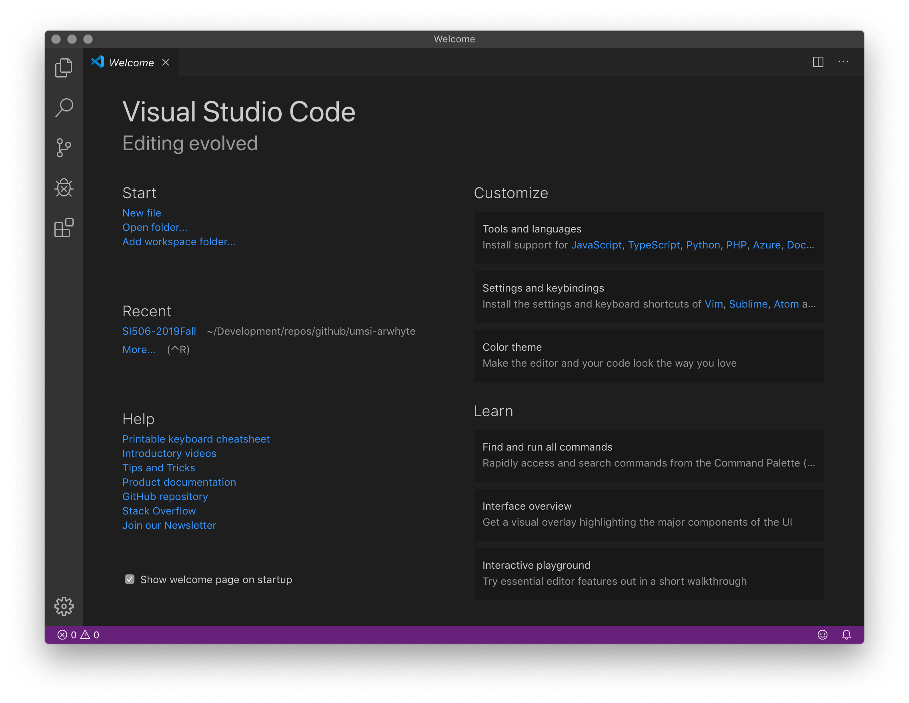
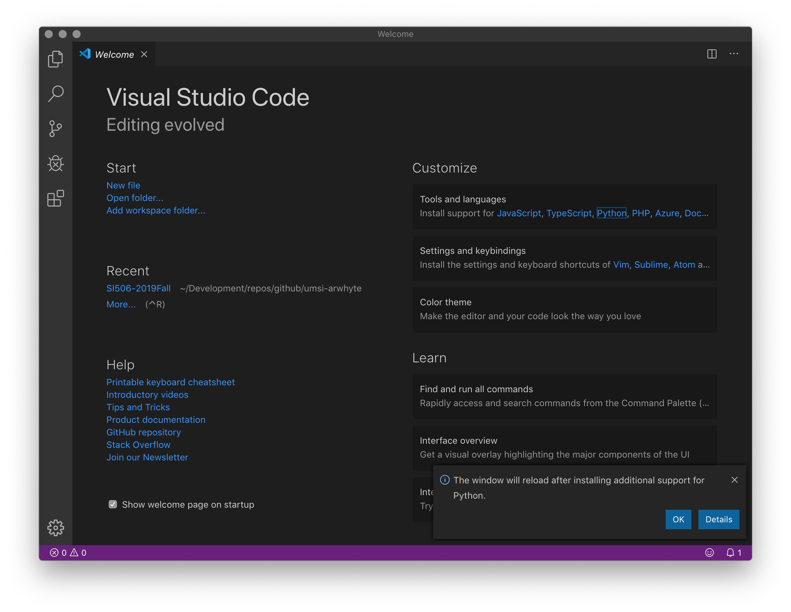
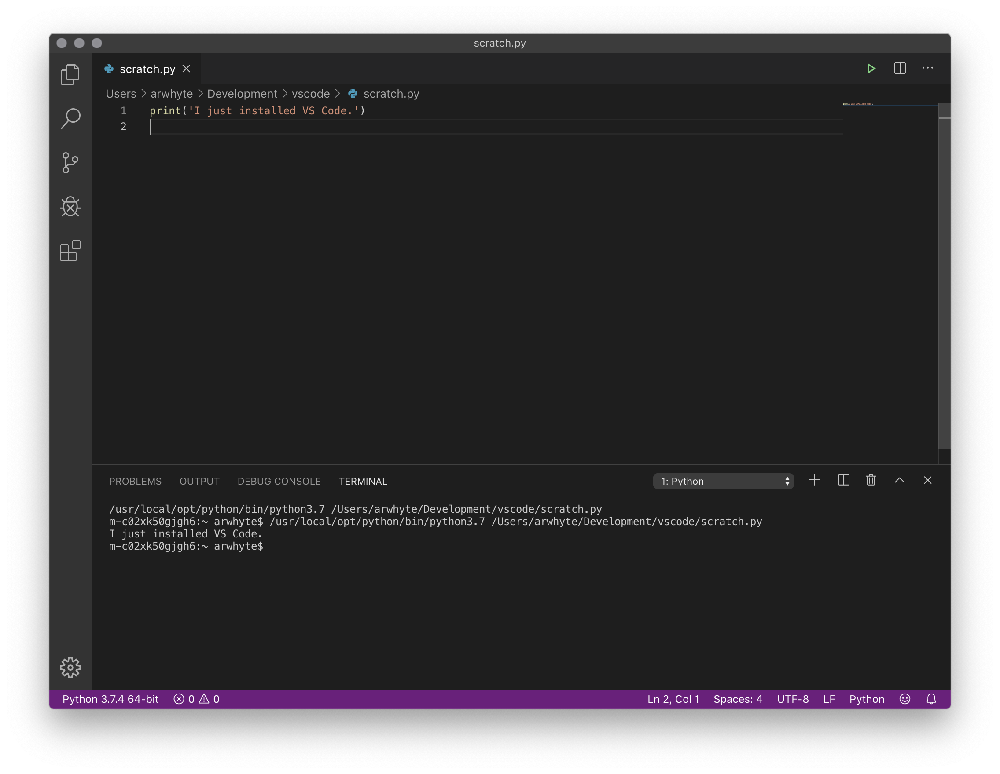

# macOS: Installing Visual Studio Code
Visual Studio Code (a.k.a VS Code) is a popular source code editor that runs on Windows, Mac, and Linux. It features
built-in support for a variety of software languages as well as extensions for languages such as Python.



## 1.0 Download Visual Studio Code
Visit the VS Code [website](https://code.visualstudio.com/). Your operating system version should have been detected 
on the page load and the link to the VS Code stable build displayed as a blue button. Click the button to 
download the install package.

## 2.0 Install Visual Studio Code
Open the Finder and locate the archive file `VSCode-darwin-stable.zip` in your `Downloads` directory (assuming, of 
course, that your downloads are saved to this directory location). Double-click the file to uncompress the contents. 
`Visual Studio Code.app` should now appear in your `Downloads` directory. Drag
`Visual Studio Code.app` to your `Applications` directory.

:bulb: Once you've added `Visual Studio Code.app` to your `Applications` directory, you can drag the blue program
icon to the dock to simplify accessing the application.

Click the VS Code icon to the start the program and display its welcome page.

 

## 3.0 Add Python extension
Under "Customize" on the right side of the welcome page, click the "Python" link under "Tools and languages" to add the
Python extension. Click the blue "OK" button in the pop up dialog (lower right). The welcome page will reload with the
"Python" link greyed out. Hover over the link with your cursor and confirm that "Python support is already installed."

 

Congratulations. VS Code is ready for you to start coding.

## 4.0 Write some code
On the welcome page under "Start" click "New file". Write the following line of code:

```python
print('I just installed VS Code.')
```
Then save the file with the name `scratch.py`.

:bulb: A dialog box will appear (lower right) stating that the linter [Pylint](https://www.pylint.org/) is not installed. 
A linter is a tool that analyzes source code for syntax and style errors, bugs, and other suspect code. Although 
linters can prove annoying on occasion (they can be configured to reduce noise) I recommend installing it. If you
choose to install it VS Code will launch a terminal to perform the install. Once installed type "exit" at the command
prompt and then press __Enter__ to close the terminal.

Now, click the green run icon (upper right) to run `scratch.py`. VS Code will start the terminal and run your file.
Say goodbye to [pythonanywhere.com's](https://www.pythonanywhere.com/) in-browser editor.

 

## 5.0 Introductory videos
Visit the VS Code [Introductory Videos](https://code.visualstudio.com/docs/getstarted/introvideos) page and familiarize
yourself with the VS Code's feature set.

## 6.0 Alternative text editors and IDEs
Besides VS Code and Python's own [IDLE](https://docs.python.org/3/library/idle.html) app, there are other code editing 
tool options such as [Atom](https://atom.io/), [Sublime Text](http://www.sublimetext.com/) or 
JetBrain's [PyCharm](https://www.jetbrains.com/pycharm/) interactive development environment (IDE) \[note: you _must_ 
apply to JetBrain's for a free [student](https://www.jetbrains.com/student/) license\] but VS Code is all the rage 
these days and I suggest that you try it out.

## License
<a rel="license" href="http://creativecommons.org/licenses/by/4.0/"></a><br />This work is licensed under a <a rel="license" href="http://creativecommons.org/licenses/by/4.0/">Creative Commons Attribution 4.0 International License</a>.
