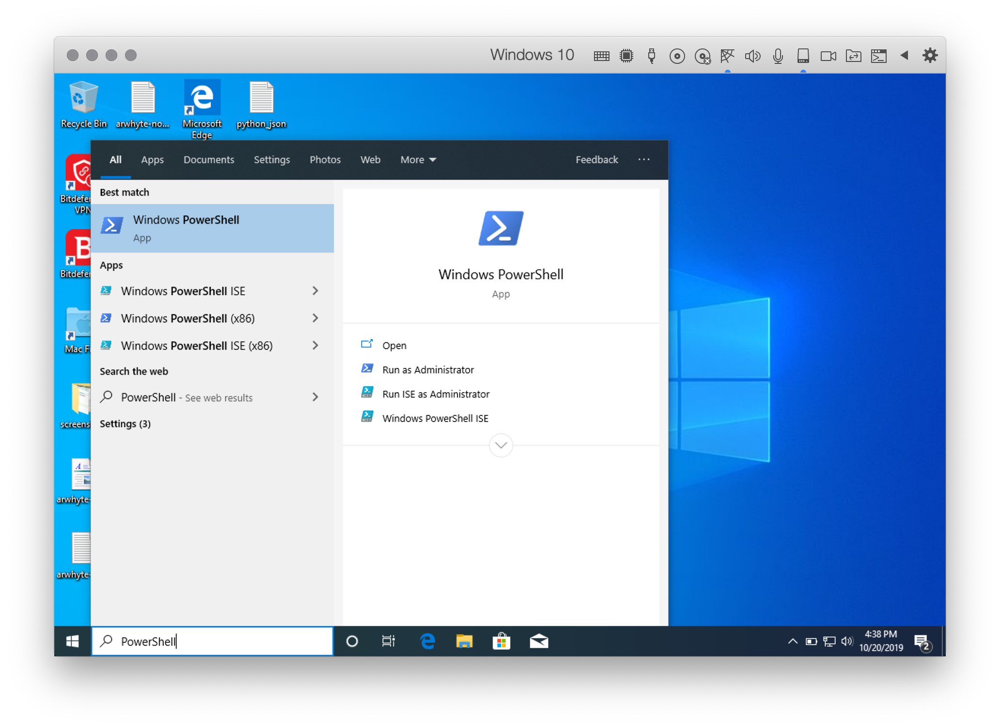
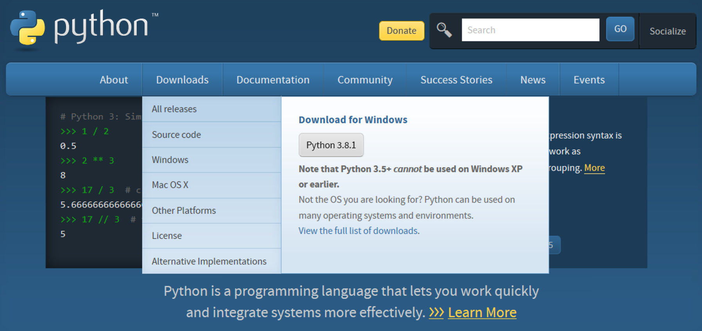
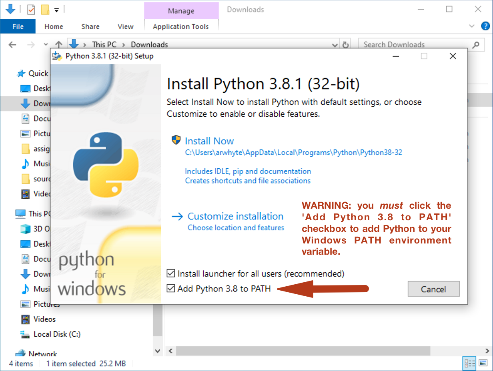
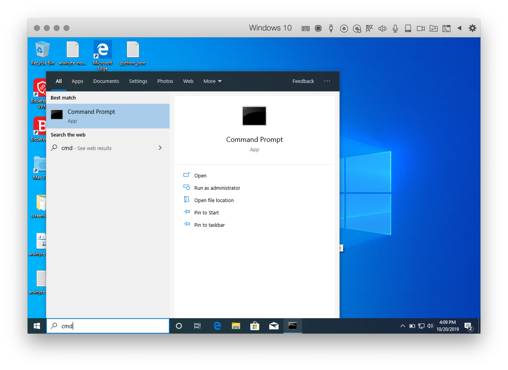
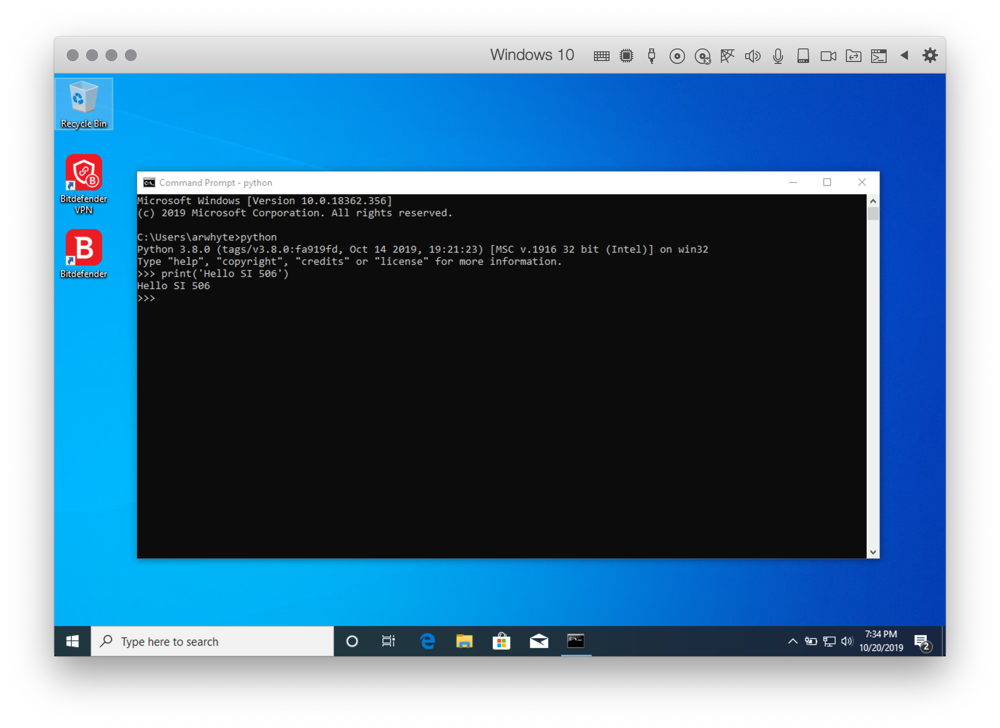
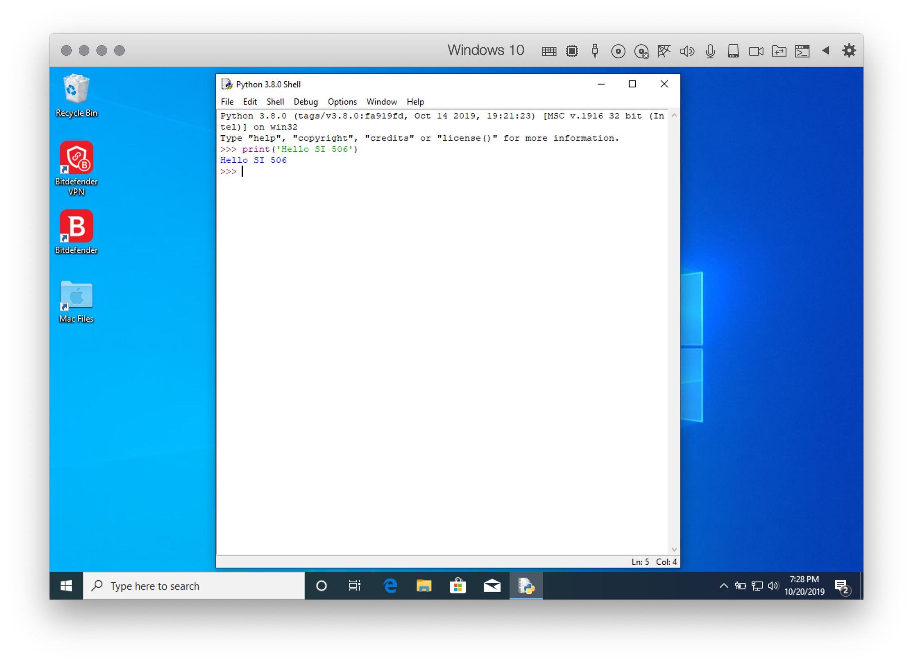

# Windows 10: Installing Python 3 (Python Software Foundation)
There are several ways to install and manage Python on Windows 10. One method involves obtaining 
Python from the Python Software Foundation [website](https://www.python.org/). 

:exclamation: Both Python 3.8.1 and the maintenance release Python 3.7.6 were released on 18 
December 2019. You can install either version but I recommend opting for Python 3.8.1 since it 
constitutes the default download release version.

:warning: The installation is simple but involves clicking a checkbox during the installation 
process that ensures the Python environment variables are added to the `PATH` variable. _Clicking 
the checkbox is a critically important step_; failure to configure the install process properly will 
require manually adding the environment variables (not fun) or deleting the Python install and 
starting over.

## 1.0 Open PowerShell.
Next to the `Start` button, enter "PowerShell" in the search box. This will surface the Windows 
PowerShell app. Click "Open" to start the shell (you can also run it as Administrator).



## 2.0 Check if Python 3 is installed
At the prompt, type `python --version` and then press __Enter__.

:bulb: Windows users invoke Python by typing `python` _not_ `python3`.

```commandline
PS C:\Users\arwhyte> python --version 
Python 3.7.4
```

If Python version 3.7.4 or above is returned, you have the right version of Python installed on your 
machine. _Proceed no further and exit this install guide_. 

:bulb: If you are running an earlier version of Python 3 you can remove it by searching for 
"Settings" in the search box on the taskbar. Open the Settings app, then click on "Apps". Scroll 
down the list of installed apps and when you reach Python, click on it and then click the 
"Uninstall" button.  

The more likely scenario is that _no version information is returned_. No problem, installing 
Python 3 is not difficult.

:bulb: To close a PowerShell session type 'exit' at the prompt and then press the __Return__ key.

## 3.0 Get Python 3 from the Python Software Foundation
Visit the Python Software Foundation [website](https://www.python.org) (my choice). Hover 
over "Downloads" on the blue menu bar. Your Windows 10 operating system version should have been 
detected on the page load and the link to the Python 3.8.x release package displayed as a grey 
button. Click the grey button to download the install package.



Windows 10 will ask "What do you want to do with `python-3.8.1.exe` (25.2 MB)?" Click the grey 
`Save` button.

Once the Python installer `*.exe` file is downloaded click the grey "Open folder" button. Then 
double-click the Python installer `*.exe` file icon to start the install process.

### 3.1 Click the install checkbox "Add Python 3.8 to PATH"
:warning: __Before__ clicking the "Install Now" box you __MUST__ click the checkbox 
"Add Python 3.8 to PATH". Selecting this option ensures that the necessary Python environment 
variables are added during the installation process. 

Adding Python to the `PATH` variable ensures that you can call `python` _directly_ from the 
PowerShell or Command Prompt. If you fail to click the checkbox you (or likely your friendly 
instructor or GSI) will need to set your Python environment variables manually. Manually adding 
Windows environment variables is tedious work.

Do this:
1. click the "Add Python 3.8 to PATH" checkbox 
2. click "Install Now" 
3. click the "Yes" button to allow the installer to make changes to the system. 

At the end of the installation process you have the option to disable the 260 max character path 
length limit. I opted to disable it. 



## 4.0 Confirm that all is well
Once installed return to PowerShell and type "exit" and then press __Enter__ to close the app. 
Restart PowerShell and confirm that Python 3 has been installed successfully.

```commandline
PS C:\users\arwhyte> python --version
Python 3.8.1
```

Then at the prompt type `python` and press __Enter__ to start the Python Interpreter. Issue the 
following `print()` statement:

```commandline
PS C:\users\arwhyte> python

>>> print('I just installed Python 3 on my laptop.')
I just installed Python 3 on my laptop.
```

:bulb: You can also start and run the Python Interpreter using the Command Prompt app (`cmd`).





## 4.0 IDLE / Visual Studio Code
The Windows Python installer also installs Python's Integrated Development and Learning Environment 
(IDLE). The `IDLE` app provides a multi-window text editor, interactive shell window, 
search/replace, and debugger. It is one of several text editors that you can use to write and test 
Python code. To learn more about IDLE see 
[https://docs.python.org/3/library/idle.html](https://docs.python.org/3/library/idle.html).




I recommend that instead of using IDLE you download, install, and use Microsoft's popular (and free) 
[Visual Studio Code](https://code.visualstudio.com/). See the companion tutorial 
[Windows 10: Installing Visual Studio Code](win-install_vscode_with_py_extension.md) for 
installation instructions. 

There are of course other solutions that you can choose. A few of the more popular apps include: 

* [Atom](https://atom.io/), 
* [Sublime Text](http://www.sublimetext.com/) or
* [PyCharm](https://www.jetbrains.com/pycharm/) interactive development environment (IDE) \[note: you 
_must_ apply to JetBrain's for a free [student](https://www.jetbrains.com/student/) license\]

That said, VS Code is all the rage these days and I suggest that you try it out.

## License
<a rel="license" href="http://creativecommons.org/licenses/by/4.0/"></a><br />This work is licensed under a <a rel="license" href="http://creativecommons.org/licenses/by/4.0/">Creative Commons Attribution 4.0 International License</a>.
