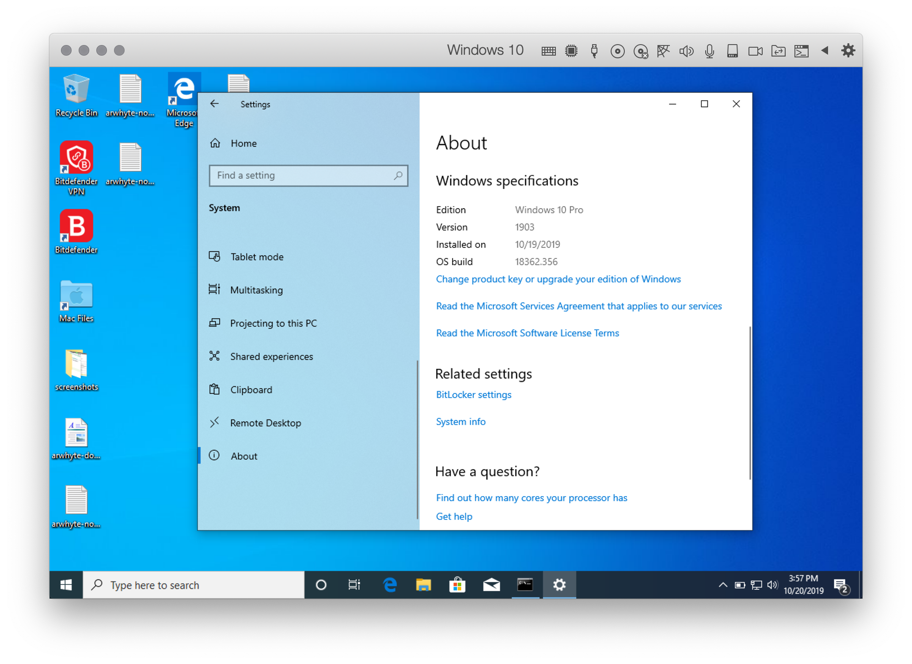
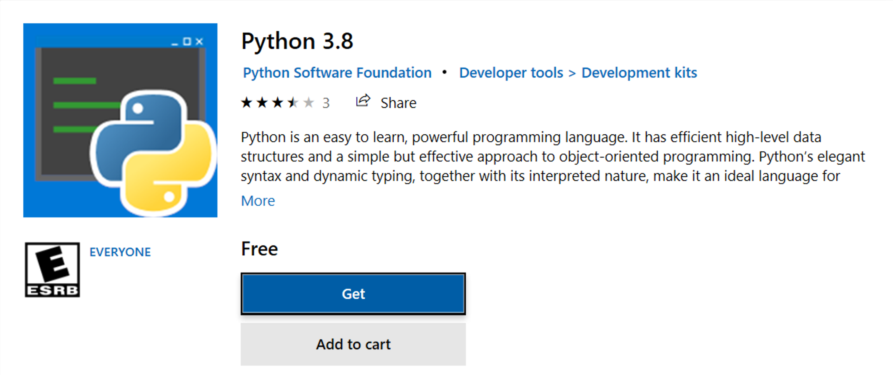
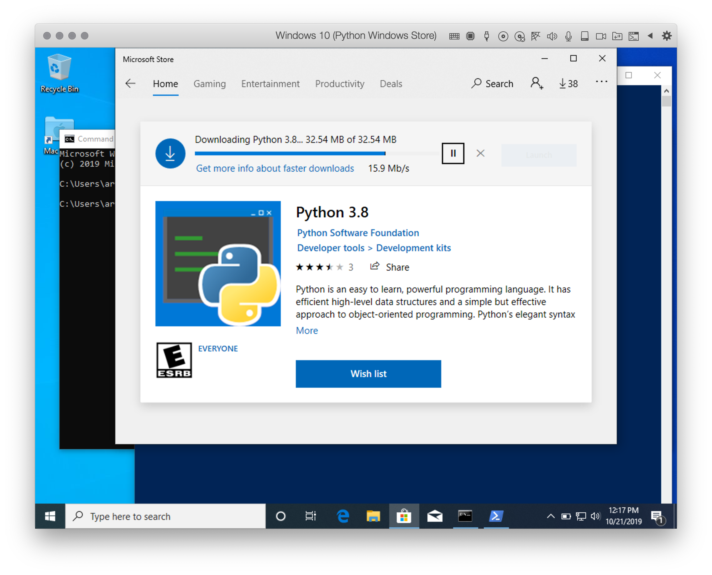
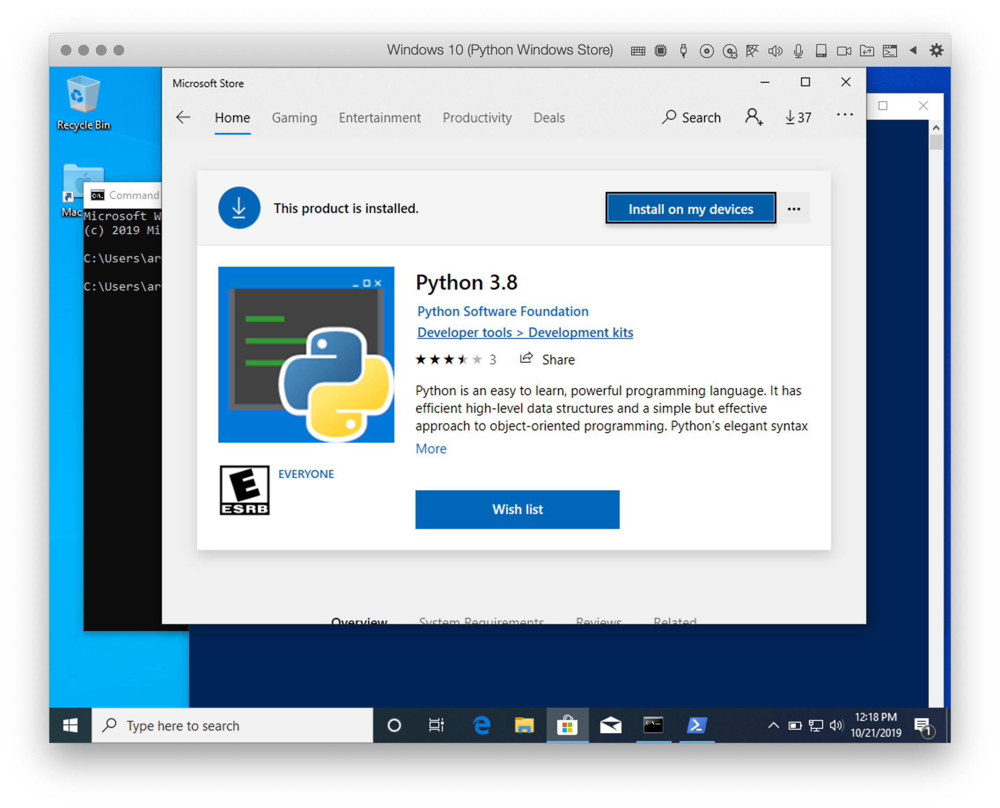

# Windows 10: Installing Python 3 (Windows Store)
There are several ways to install and manage Python on Windows 10. One method involves obtaining Python from the 
Windows Store. The installation is simple but _requires_ that you are running the __May 2019 update__ of 
Windows 10 (version 1903).

### 1.0 Check Windows 10 version
Starting with the May 2019 Windows 10 update you can acquire Python 3 from the Microsoft Store. 
To check which version of Windows 10 is running on your machine do the following:

1. Click the `Start` button and then select `Settings`.
2. In `Settings`, click `System` 
3. Scroll down and click `About`.



If the version displayed is Windows 10, version 
[1903](https://docs.microsoft.com/en-us/windows/release-information/status-windows-10-1903), you are running the 
May 2019 update and can acquire Python 3 from the Windows Store. If not, consider updating your version of Windows 10 
or visit the Python Software Foundation's [website](https://www.python.org/) to acquire Python 3.

:warning: If you are running an earlier version of Windows 10 and do not wish to update your operating system, visit 
the Python Software Foundation's [website](https://www.python.org/) and download and install Python 3. Switch to 
the companion tutorial [Windows 10: Installing Python 3 (Python Software Foundation)](win-install-pysf_python.md) 
for installation instructions.

## 2.0 Open PowerShell.
Next to the `Start` button, enter "PowerShell" in the search box. This will surface the Windows PowerShell app. 
Click "Open" to start the shell (you can also run it as Administrator).


## 3.0 Check if Python 3 is installed
At the prompt, type `python --version` and then press __Enter__.

:bulb: Windows users typically invoke Python by typing `python` _not_ `python3`. Once the Windows Store version is 
installe you will be able to use either command to start the Python Interpreter (as is explained below).

```commandline
PS C:\Users\arwhyte> python --version 
Python 3.7.4
```

If Python version 3.7.4 or above is returned, you have the right version of Python installed on you machine. 
_Proceed no further and exit this install guide_. 

:bulb: If you are running an earlier version of Python 3 you can remove it by searching for "Settings" in the search 
box on the taskbar. Open the Settings app, then click on "Apps". Scrolled down the list of installed apps and when you 
reach Python, click on it and then click the "Uninstall" button.  

The more likely scenario is that _no version information is returned_. No problem, installing Python 3 is not difficult.

:bulb: To close a PowerShell session type 'exit' at the prompt and then press the __Return__ key.

## 4.0 Get Python 3 from the Windows Store
If you are running the __May 2019 update__ of Windows 10 (version 1903) you can obtain Python 3 from the 
Microsoft Store. 

Return to PowerShell. Type `python` or `python3` and press __Enter__. 

```commandline
PS C:\Users\arwhyte> python
```

If Python 3 is _not_ installed you will be redirected immediately to the Microsoft Store and the 
Python 3.7 store page.  

:exclamation: Python 3.8 is also available in the Store. Python 3.8.0 was released on 14 October 2019 while the 
maintenance release Python 3.7.5 was released on 15 October 2019. You can install either version.  I tested both 
versions and chose to install Python 3.8.0.


Click "Search" and enter "Python 3.8" to retrieve its page.



Once you choose which version to install, press the blue "Get" button to download and install Python 3.

:bulb: When prompted to install Python 3 across all devices, I _declined_ with a "No thanks" (I am running Windows 
in a virtual machine on my Mac using Parallels Desktop).



Cool. It's installed with little fuss.



Once Python is installed you can connect to the Python Interpreter immediately using PowerShell or the Command Prompt
(Search "cmd") app. 

:bulb: Unlike the Python Software Foundation installation process you do not need have to explicitly add Python 
environment variables to your `PATH` variable; the modifications are made for you during the Windows Store install 
process. Nice.

## 5.0 Confirm that all is well
Return to PowerShell and type "python --version" and then press __Enter__ to close the app. Restart PowerShell and
confirm that Python 3 has been installed successfully.

```commandline
PS C:\users\arwhyte> python --version
Python 3.8.0
```

Then type `python` and press __Enter__ to start the Python Interpreter. Issue the following `print()` 
statement:

```commandline
PS C:\users\arwhyte> python

>>> print('I just installed Python 3 on my laptop.')
I just installed Python 3 on my laptop.
```

The Windows Store version of Python also makes available common Linux-style commands such as `python3`, `python3.7`, 
`python3.8`, pip` and `idle`.

For more information on the thinking behind this approach by a member of Microsoft's Python team, read Steve Dower's 
[post](https://devblogs.microsoft.com/python/python-in-the-windows-10-may-2019-update/) on the subject.

:bulb: You can also use the Command Prompt app (Search "cmd") to accomplish the above tasks.


## 6.0 IDLE / Visual Studio Code
The Windows Python installer also installs Python's Integrated Development and Learning Environment (IDLE). The `IDLE` 
app provides a multi-window text editor, interactive shell window, search/replace, and debugger. It is one of several 
text editors that you can use to write and test Python code. To learn more about IDLE 
see [https://docs.python.org/3/library/idle.html](https://docs.python.org/3/library/idle.html). 

:warning: Both the Windows Store Python 3.8 and 3.7 releases include a bug that prevents opening the IDLE app. 
Attempting to launch the app triggers the following error message: 

> "The code execution cannot proceed because MSVCP140.DLL was not found. . . ." 

This issue has allegedly been addressed but I still encountered the error. See the following 
[bug report](https://bugs.python.org/issue38492) for details.

Once the fix has been deployed in a future Windows update, you will be able to launch IDLE from the search box on the 
taskbar or from the Command Prompt app by typing 'idle' and then pressing __Return__.


No matter, I recommend that instead of using IDLE you download, install, and use Microsoft's popular (and free) 
[Visual Studio Code](https://code.visualstudio.com/). See the companion tutorial 
[Windows 10: Installing Visual Studio Code](win-install_vscode_with_py_extension.md) for installation 
instructions. 

There are of course other options such as [Atom](https://atom.io/), [Sublime Text](http://www.sublimetext.com/) or 
JetBrain's [PyCharm](https://www.jetbrains.com/pycharm/) interactive development environment (IDE) \[note: you 
_must_ apply to JetBrain's for a free [student](https://www.jetbrains.com/student/) license\] but VS Code is all 
the rage these days and I suggest that you try it out.

## License
<a rel="license" href="http://creativecommons.org/licenses/by/4.0/"></a><br />This work is licensed under a <a rel="license" href="http://creativecommons.org/licenses/by/4.0/">Creative Commons Attribution 4.0 International License</a>.
